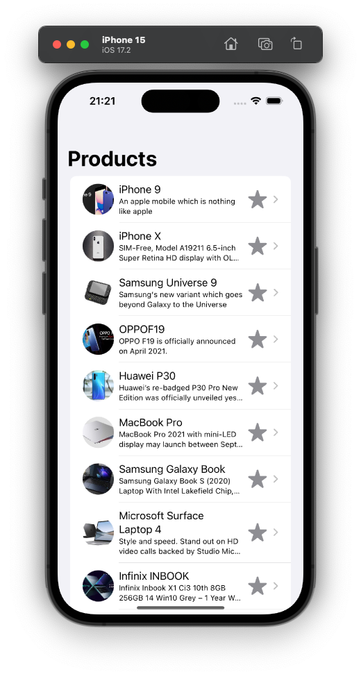
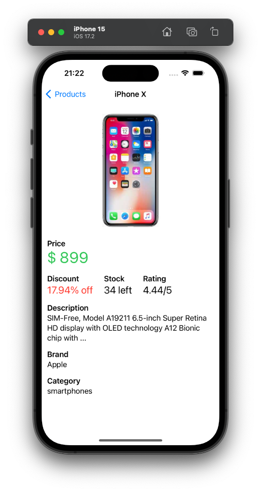

# Product Viewer
Product Viewer is a sample iOS app made with SwiftUI. It uses the [MVVM](https://www.hackingwithswift.com/books/ios-swiftui/introducing-mvvm-into-your-swiftui-project) architecture, and manages its state using [Combine](https://developer.apple.com/documentation/combine).

## Installation
Download the source code, and run it on a device or simulator using Xcode.

## Features

| Product List | Product Details |
| ----- | ----- |
|  |  |

### Product List
A List of products, where every product is displayed in a row with its name, description, thumbnail image and an icon that represents its rating. The list shows 10 products, and 10 more are loaded using the button **Load more** at the bottom of the list.

### Product Details
A details screen, displaying the products image, name, description, price, and other information.

## Architecture
The app uses the [MVVM](https://www.hackingwithswift.com/books/ios-swiftui/introducing-mvvm-into-your-swiftui-project) architecture, and uses Combine for state management.

View Models are `ObservableObjects` that are watched on the `Views` using `@StateObject`. Relevant information is marked as `@Published` on the View Models, so the `View` can autoupdate when it's changed.

## Dependency Injection
As for dependency injection, network services and important models are injected in the ViewModels, on the `init` method. This way we can test the logic on the View Models with mocked data, and without having real HTTP requests.

Because the dependency injection is made using protocols, it's pretty simple to create mocks for testing and previews.

## Unit Testing
The View Models' logic is tested using the native `XCTest`.

## Other Features
* Cache using [URLCache](https://developer.apple.com/documentation/foundation/urlcache)
* Error handling and alerts
* Async image loading
* URLRequests made with `async` `await`
* Preview mocks
